## 1. 安装虚拟环境管理插件

打开vscode后，找到右边插件栏（四个小方块对应的图标），在上方的搜索栏搜索`Python Environment Manager`，点击"install"，后面我们会通过这个插件管理虚拟环境。
<div style="text-align: center;">
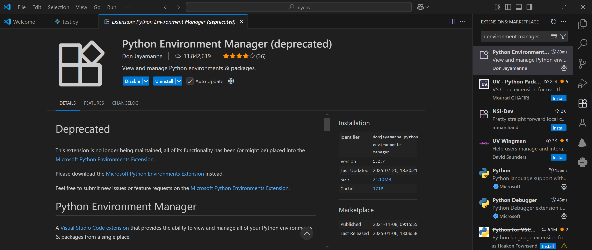
</div>

## 2. 创建文件

在开始之前，我们需要准备需要运行的文件，在这里我在桌面路径为`C:/Users/szhan/Desktop/Test`（我的桌面）的地方创建一个名为`test.py`的文件。这个路径就是我们的项目路径，同时我们希望虚拟环境也位于这个项目路径中。
<div style="text-align: center;">
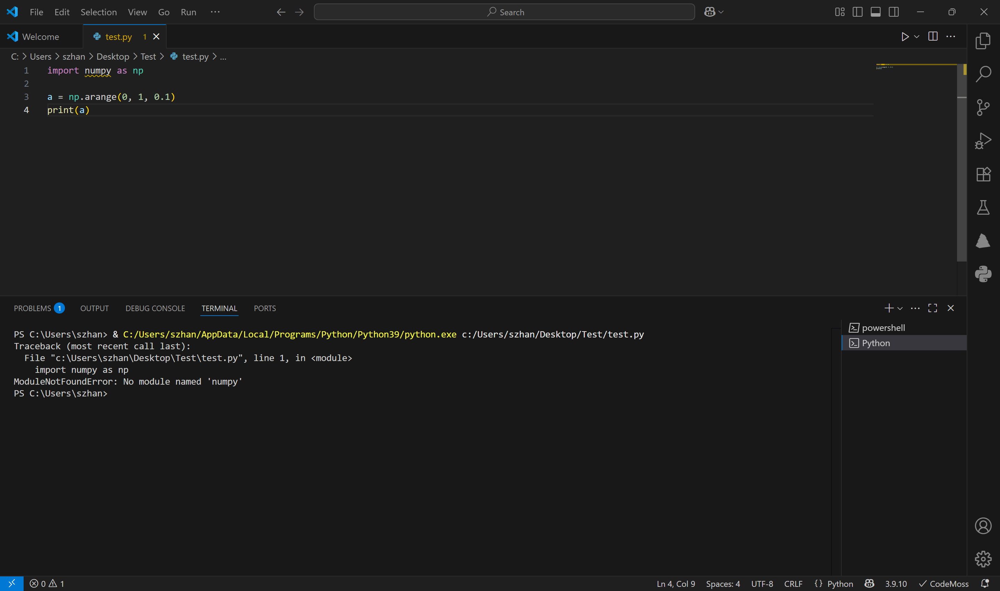
</div>

在这里我写了个简单的代码，发现直接运行提示`No module named...`
这非常不对劲啊非常不对劲😮😮😮
原因是**此时默认使用安装python路径作为环境的**，其中没有任何包。我的包都在anaconda的python环境里。

## 3. 创建虚拟环境

我们将虚拟环境安装于这个项目路径中，先在终端中转到项目路径：
```powershell
cd C:\Users\szhan\Desktop\Test
```
该路径可以通右击代码文件获取：
<div style="text-align: center;">
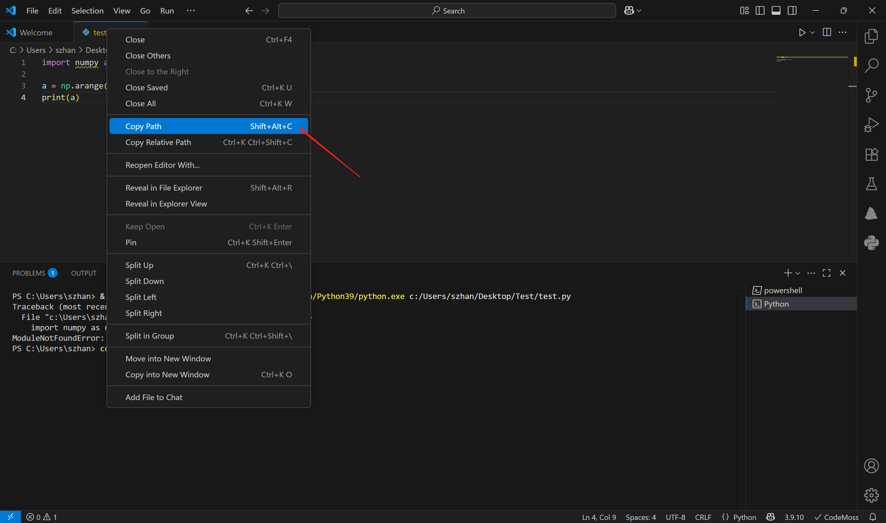
</div>

然后按照3个小步骤执行，如下图所示：
- 创建名为`new_env`的虚拟环境：
```powershell
 python -m venv new_env
```
- 在右边的Python Environment Manager（刚刚下载好的插件）里有一栏`PYTHON GLOBAL ENVIRONMENTS`，点击其中的`Venv`右边的"+"，以添加虚拟环境
- 随后右下角会出现提示，提醒我们需要添加虚拟环境的路径，手动选择`C:\Users\szhan\Desktop\Test\new_env`即可
<div style="text-align: center;">
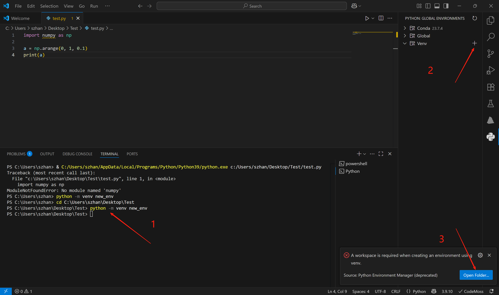
</div>

## 4. 重新打开文件并运行
创建新环境后，vscode会自动重新打开一个空白窗口，我们打开刚刚建好的文件即可：
<div style="text-align: center;">
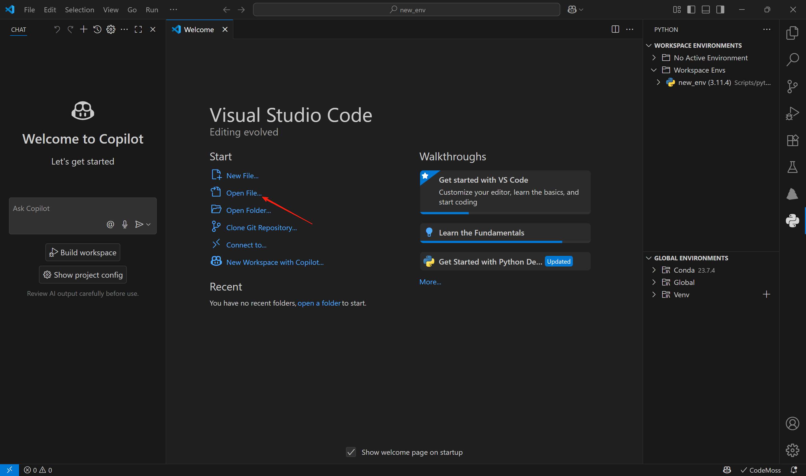
</div>

可以看见我们的new_env环境出现在右边栏中。
重新打开文件后在终端中运行：
<div style="text-align: center;">
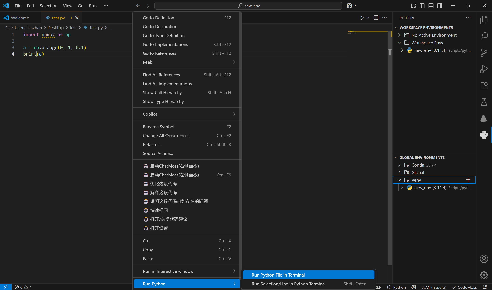
</div>

如果是第一次操作有可能会出现以下情况，糟糕糟糕😭😭😭！
<div style="text-align: center;">
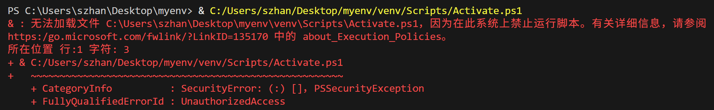
</div>

这是因为vscode的终端没有管理员权限激活环境。

## 5. 激活环境

（1）首先解决权限问题（如果没有以上红色字情况可忽略）。打开windows，搜索`powershell`，点击“以管理员身份运行”：
<div style="text-align: center;">
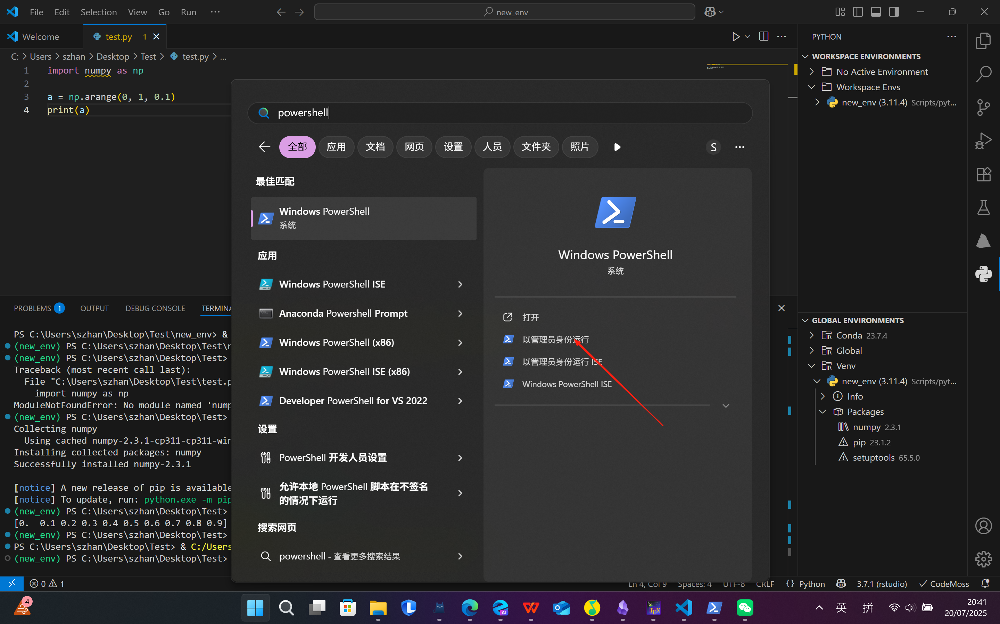
</div>

随后复制如下代码至命令行：
```powershell
 Set-ExecutionPolicy RemoteSigned
```

在弹出提示后输入`Y`，如图所示：
<div style="text-align: center;">
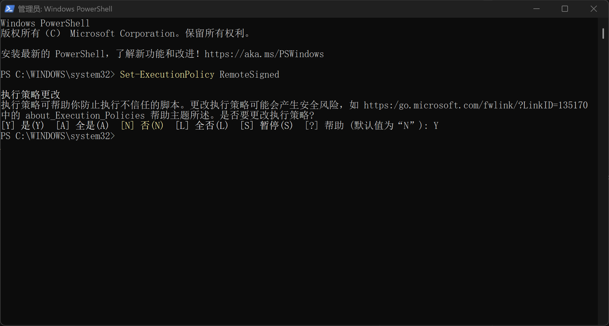
</div>

（2）激活环境需要点击右下角我们自创环境右边的【命令行窗口形状的小图标】，如图所示：
<div style="text-align: center;">
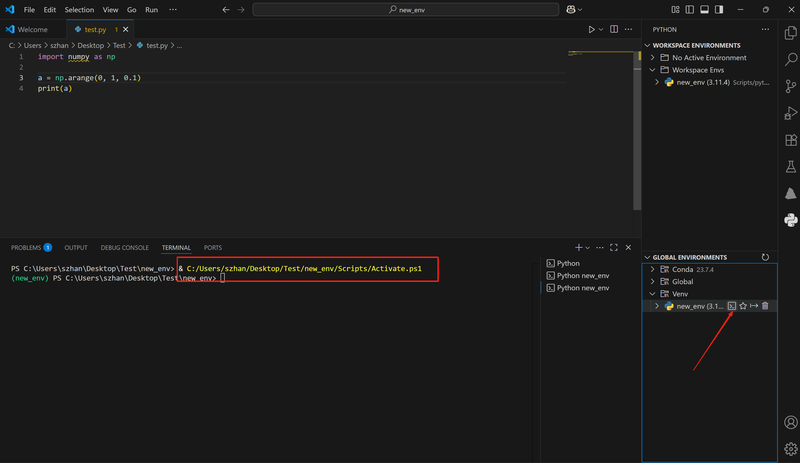
</div>

点击后即可在终端中看到框中的代码（它是激活环境的代码命令），和激活好的绿色字“new_env"。

## 6. 最终运行

激活好环境我们就可以运行代码了，转到代码路径，并运行：
```powershell
cd cd C:\Users\szhan\Desktop\Test
python test.py
```

由于这是个空环境，直接运行仍会报错。安装包：
```powershell
pip install numpy
```

再次运行成功了。以上过程在下图中展现：
<div style="text-align: center;">
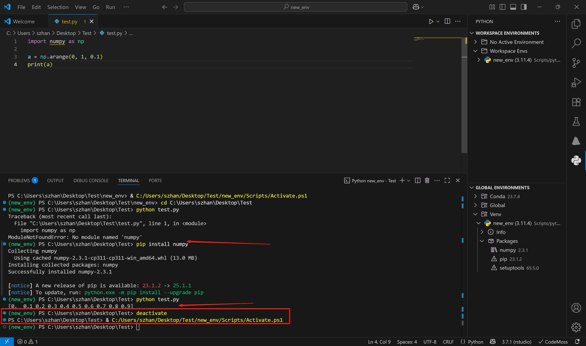
</div>

**太好了！We make it!** 🎉🎉🎉😄😄😄

## 7. 退出/重启环境

实际操作过程中，我们可能想换一个环境运行其他代码。这需要一个退出环境的操作，直接命令行输入：
```powershell
deactivate
```
如果想激活某个环境，有两种办法：
- 点击右下角我们自创环境右边的【命令行窗口形状的小图标】
- 输入激活环境命令行代码：
```powershell
& C:/Users/szhan/Desktop/Test/new_env/Scripts/Activate.ps1
```
